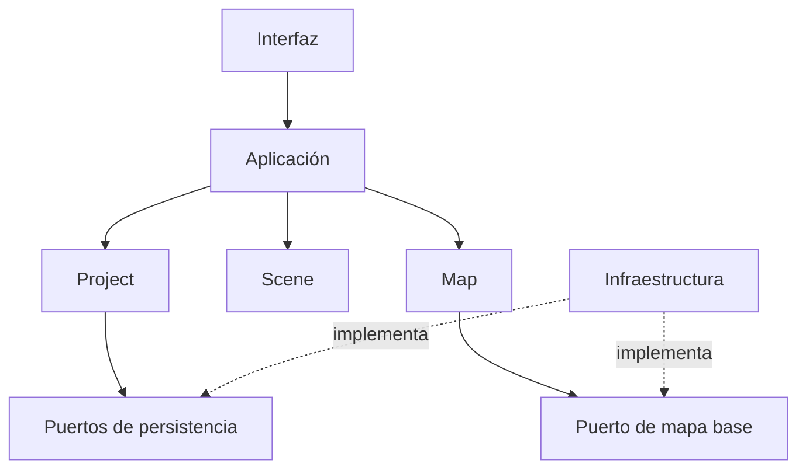
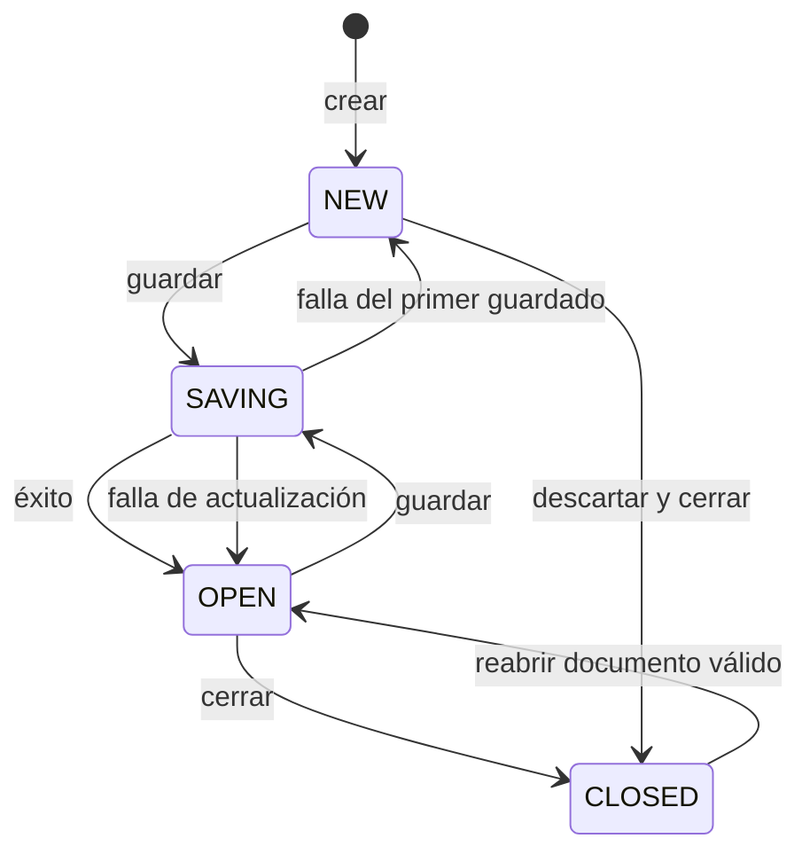
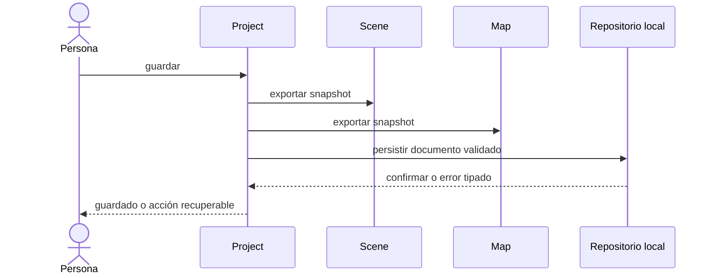

# GeoMotion Studio

# 19 · ARQUITECTURA Y DOMINIO MÍNIMOS DEL PILOTO

**Código:** `DOC-019`  
**Versión:** `1.0.0`  
**Estado:** Vigente — publicación material de `LB-G5-GMS-20260907-01` verificada  
**Fecha:** 7 de septiembre de 2026  
**Clasificación:** Manual de Ingeniería  
**Etapa:** G5 — Arquitectura y dominio mínimos  
**Iniciativa:** `INI-GMS-0001`  
**Línea base de entrada:** `LB-G4-GMS-20260904-01`  
**Autoridad:** Founder  
**Trazabilidad:** `ACTO-G5-GMS-20260907-11`; D-37 a D-48  
**Línea base prevista:** `LB-G5-GMS-20260907-01`

---

## 1. Propósito

Consolidar la arquitectura y el dominio estrictamente necesarios para especificar `INI-GMS-0001`: crear, guardar, cerrar y reabrir un proyecto local con una escena y una vista cartográfica base bidimensional, restaurando el estado definido.

Este documento especializa la arquitectura vigente para el piloto. No reemplaza ni duplica la Visión, la Constitución, el Manual de Ingeniería, los ADR vigentes, el gobierno SDD ni los documentos de producto aprobados.

El documento no es una SPEC, no selecciona una implementación, no modifica `apps/web` y no autoriza código funcional. Se encuentra vigente desde la publicación material verificada de la Línea base G5 exacta.

## 2. Fuentes y precedencia

La interpretación del presente candidato queda subordinada a las fuentes institucionales aprobadas y vigentes, entre ellas:

- DOC-001 · Visión del Producto;
- DOC-002 · Arquitectura;
- DOC-006 · Constitución del Proyecto;
- DOC-010 · Estado Global;
- DOC-012 · Arquitectura Cartográfica;
- DOC-014 · Decisiones de Arquitectura;
- DOC-017 · Autenticación y Seguridad;
- DOC-018 · Gestión de Versiones;
- ADR-016, ADR-019, ADR-020, ADR-021 y ADR-027;
- `REG-IVX-GMS-001`;
- `MOD-SDD-GMS-001`;
- `INI-GMS-0001`; y
- el Itinerario Maestro SDD v1.0.0.

Ante una colisión, prevalece la fuente institucional competente y de mayor autoridad o la versión sucesora expresamente aprobada. Este documento fue aprobado para incorporación mediante D-37 a D-48; adquirirá vigencia únicamente con su publicación dentro de `LB-G5-GMS-20260907-01`.

## 3. Alcance arquitectónico

### 3.1 Incluido

El piloto comprende solamente:

1. una persona creadora local actuando sin cuenta obligatoria;
2. un proyecto activo;
3. una escena inicial;
4. una vista cartográfica 2D asociada a esa escena;
5. navegación mínima mediante centro geográfico y nivel de zoom;
6. un mapa base resoluble sin exigir un servicio remoto;
7. composición, validación, guardado y reapertura del Project Document;
8. restauración del estado persistente mínimo; y
9. comunicación segura y recuperable de errores comprendidos por el alcance.

### 3.2 Excluido

Quedan fuera:

- múltiples escenas como comportamiento exigible del piloto, aunque el modelo no las impide;
- 3D, terreno, cámara cinematográfica y render final;
- capas incorporadas por la persona, Assets, Objects, Timeline y Export;
- cuentas, autenticación, organizaciones y roles de autorización;
- sincronización, almacenamiento remoto, colaboración y publicación externa;
- plugins, APIs públicas, Marketplace y extensiones;
- IA de producto;
- telemetría remota;
- selección de framework, motor cartográfico, formato físico o backend de almacenamiento;
- métricas, umbrales, navegadores, dispositivos y estrategia de pruebas de G6; y
- cualquier implementación funcional antes de G9.

## 4. Clasificación canónica de elementos

| Elemento | Clasificación | Identidad | Propietario | Persistencia | No es |
|---|---|---|---|---|---|
| Project | Entidad raíz de trabajo | `projectId`, estable | Módulo Project | Mediante representación en Project Document | Archivo, pantalla o contenedor de implementaciones ajenas |
| Scene | Entidad subordinada | `sceneId`, estable dentro del Project | Módulo Scene | Mediante snapshot aportado al Project Document | Render, mapa o componente visual |
| Map View | Entidad de estado de representación | `mapViewId`, estable dentro del Project | Módulo Map | Mediante snapshot aportado al Project Document | Territorio, Scene, motor cartográfico o viewport DOM |
| Project Document | Agregado documental versionado | `projectId` más `formatVersion` | Módulo Project para composición y persistencia | Es la representación persistente del corte guardado | Entidad viva, módulo, base de datos o formato físico específico |
| Base Map Resource | Recurso cartográfico referenciado | `baseMapRef` lógico | Módulo Map sobre un puerto de recurso | La referencia se persiste; el recurso no se incrusta por defecto | Map View, capa editable o proveedor obligatorio |
| Componente de interfaz | Componente de presentación/interacción | Identidad técnica opcional | Capa de interfaz | No posee datos de dominio | Entidad, agregado o propietario de Project/Scene/Map View |

Reglas:

1. Una identidad de dominio no se deriva de una ruta, índice visual o posición en una colección.
2. El Project Document representa datos; no desplaza la propiedad de esos datos desde sus módulos.
3. Los componentes consumen contratos y proyectan estado; no son propietarios del estado de dominio.
4. Un recurso externo o incluido se referencia mediante identidad lógica; el dominio no depende del proveedor.

## 5. Mapa modular vigente aplicado al piloto

| Área | Responsabilidad en el piloto | Publica | Consume | Prohibiciones |
|---|---|---|---|---|
| Interfaz | Recibir intención, presentar estado y errores | Ningún estado de dominio | Contratos de aplicación | Persistir por cuenta propia; acceder a internals; decidir autorización |
| Aplicación | Orquestar los casos de uso del piloto | Casos de uso | Contratos de Project, Scene, Map e identidad | Convertirse en propietario de entidades |
| Project | Ciclo de vida del Project; composición, validación y persistencia del Project Document | `CTR-GMS-PRJ-*` | Instantáneas de Scene y Map; puerto de repositorio | Administrar implementaciones internas cartográficas o de Scene |
| Scene | Identidad, pertenencia, orden y activación de Scene; asociación con Map View | `CTR-GMS-SCN-*` | Contratos publicados cuando corresponda | Gestionar navegación, recursos cartográficos o persistencia directa |
| Map | Identidad y semántica de Map View; navegación; referencia al mapa base | `CTR-GMS-MAP-*` | Puerto de recurso cartográfico | Asumir Scene, Project, UI o backend concreto |
| Identidad y autorización | Proporcionar contexto local temporal y evaluar acciones del piloto | `CTR-GMS-AUT-001` | Política mínima aprobada | Inventar cuentas, roles o permisos futuros |
| Infraestructura | Implementar los puertos de almacenamiento y recurso cartográfico | Adaptadores privados | Contratos de puerto | Filtrar detalles tecnológicos al dominio |

### 5.1 Vista de dependencias



Las flechas expresan dependencia sobre contratos publicados. No autorizan dependencias entre implementaciones internas.

### 5.2 Reglas de frontera

1. La interfaz y la aplicación no escriben directamente Project Document.
2. Project coordina el guardado y la reapertura; Scene y Map entregan o restauran snapshots mediante sus propios contratos.
3. Scene es propietaria de la asociación entre una escena y su `mapViewId`; Map es propietario del estado interno de la Map View identificada.
4. Project conserva `activeSceneId`, pero Scene valida que la referencia corresponda a una escena existente.
5. Project Document contiene secciones aportadas por los módulos; no permite que Project modifique semántica ajena.
6. La infraestructura depende de los puertos; los módulos no dependen de adaptadores concretos.
7. No existen dependencias circulares entre Project, Scene y Map.

## 6. Modelo de dominio mínimo

### 6.1 Project

Datos mínimos:

| Campo conceptual | Regla |
|---|---|
| `projectId` | Obligatorio, opaco, único y estable durante la vida del Project |
| `name` | Obligatorio; reglas funcionales de longitud y caracteres se fijarán en la futura SPEC, ejercitando los datos internacionales de DOC-020 |
| `sceneIds` | Colección no vacía para el piloto |
| `activeSceneId` | Referencia exactamente a un miembro de `sceneIds` |
| `lifecycleState` | Uno de los estados definidos en §7.1 |
| `persistenceCondition` | Una de las condiciones definidas en §7.2 |

Project coordina el agregado de trabajo, pero no absorbe el contenido interno de Scene ni de Map View.

### 6.2 Scene

Datos mínimos:

| Campo conceptual | Regla |
|---|---|
| `sceneId` | Obligatorio, opaco y estable |
| `projectId` | Referencia al único Project al que pertenece |
| `name` | Obligatorio |
| `order` | Entero no negativo y único entre escenas hermanas |
| `mapViewId` | Referencia a la Map View asociada |
| `operationalState` | Uno de los estados definidos en §7.3 |

El piloto exige una Scene inicial. El modelo admite evolución a más escenas sin incorporarla a los criterios del primer incremento.

### 6.3 Map View

Datos persistentes mínimos:

| Campo conceptual | Regla |
|---|---|
| `mapViewId` | Obligatorio, opaco y estable |
| `sceneId` | Referencia a la única Scene que la incorpora |
| `mode` | Valor fijo `2D` en el piloto |
| `center.longitude` | Número finito en grados, entre −180 y 180 |
| `center.latitude` | Número finito en grados, entre −90 y 90 |
| `zoom` | Número finito no negativo y compatible con el recurso activo |
| `baseMapRef` | Referencia lógica a un recurso cartográfico permitido |

La semántica canónica del centro se expresa como longitud y latitud geográficas WGS 84. El motor podrá proyectarlas internamente, pero no podrá convertir su representación propietaria en el contrato de dominio.

No se persisten en el mínimo:

- tamaño del viewport;
- nodos del DOM o referencias a componentes;
- caché, teselas ni objetos del motor;
- estados de puntero o gestos en curso;
- métricas de render;
- selecciones de entidades todavía inexistentes; ni
- credenciales o secretos del proveedor.

### 6.4 Project Document

El Project Document es un agregado documental y una representación de intercambio interna del guardado. Su esquema lógico mínimo es:

```text
ProjectDocument
├── documentType = "geomotion-project"
├── formatVersion = 1
├── project
│   ├── projectId
│   ├── name
│   └── activeSceneId
├── scenes[]
│   ├── sceneId
│   ├── projectId
│   ├── name
│   ├── order
│   └── mapViewId
└── mapViews[]
    ├── mapViewId
    ├── sceneId
    ├── mode
    ├── center
    ├── zoom
    └── baseMapRef
```

La codificación física, la extensión de archivo y el lenguaje formal del schema quedan abiertos para G7. Cualquier materialización deberá preservar exactamente estas responsabilidades y permitir validación automática.

## 7. Estados y transiciones

### 7.1 Estado operativo de Project

| Estado | Significado | Persistente |
|---|---|---:|
| `NEW` | Project inicializado y todavía sin guardado válido | No |
| `OPEN` | Project activo y disponible para interacción | No |
| `SAVING` | Project bloqueado transitoriamente para producir un guardado consistente | No |
| `CLOSED` | El contexto activo fue liberado; la entidad puede reabrirse desde documento | No |



El cierre con cambios pendientes deberá ofrecer `guardar`, `descartar` o `cancelar`; su presentación y criterios binarios se definirán en la SPEC. Un fallo no puede simular una transición exitosa.

### 7.2 Condición de persistencia de Project

La condición de persistencia es ortogonal al estado operativo:

| Condición | Significado |
|---|---|
| `UNSAVED` | Nunca existe un Project Document válido confirmado |
| `CLEAN` | El estado vivo coincide con el último documento confirmado |
| `DIRTY` | Existe al menos un cambio posterior al último documento confirmado |
| `RECOVERED` | El Project se abrió desde una fuente de recuperación válida y aún no fue confirmado mediante un guardado ordinario |

Reglas de correspondencia con DOC-002: `Nuevo` se especializa como `NEW/UNSAVED`; `Abierto` como `OPEN`; `Modificado` como `OPEN/DIRTY`; `Guardado` como `OPEN/CLEAN`; `Cerrado` como `CLOSED`; y `Recuperado` como `OPEN/RECOVERED`.

DOC-020 fija las garantías de recuperación aprobadas para incorporación; G7 decidirá y verificará el mecanismo material capaz de producir `RECOVERED`. La semántica no afirma que ese mecanismo exista antes de superar sus puertas.

### 7.3 Estado operativo de Scene

| Estado | Transiciones permitidas |
|---|---|
| `INITIALIZING` | a `ACTIVE` si la creación es válida; a eliminación si falla antes de incorporarse |
| `ACTIVE` | a `INACTIVE` cuando otra Scene se activa; a `CLOSED` con el Project |
| `INACTIVE` | a `ACTIVE`; a `CLOSED` con el Project |
| `CLOSED` | a `ACTIVE` o `INACTIVE` únicamente mediante reapertura válida del Project |

En el piloto existe exactamente una Scene y, mientras el Project está abierto, debe estar `ACTIVE`.

### 7.4 Estado operativo de Map View

| Estado | Significado | Efecto |
|---|---|---|
| `INITIALIZING` | Se valida y resuelve la configuración | No se presenta como lista |
| `READY` | Configuración válida y recurso base disponible | Permite navegación |
| `DEGRADED` | Configuración válida, pero el recurso base no puede resolverse temporalmente | El Project sigue abierto; se comunica error recuperable |
| `CLOSED` | Su Scene/Project no está activo | No admite navegación |

Cambiar `center` o `zoom` mantiene `READY` y vuelve `DIRTY` la condición de persistencia del Project. La disponibilidad del recurso no se persiste porque describe infraestructura, no dominio.

### 7.5 Validación del Project Document

| Resultado | Condición |
|---|---|
| `VALID` | Envelope y todos los fragmentos satisfacen schema, versión e invariantes |
| `INVALID` | Estructura, referencias o datos violan el contrato |
| `UNSUPPORTED_VERSION` | `formatVersion` no puede interpretarse ni migrarse de forma admitida |

Solo `VALID` puede reemplazar el contexto activo. La recuperación no puede convertir silenciosamente un documento inválido en válido.

## 8. Invariantes del piloto

| ID | Invariante |
|---|---|
| `INV-G5-001` | Todo Project posee un `projectId` estable y no vacío. |
| `INV-G5-002` | Un Project abierto del piloto contiene exactamente una Scene y una `activeSceneId` válida. |
| `INV-G5-003` | Toda Scene pertenece a un único Project. |
| `INV-G5-004` | La única Scene del piloto permanece activa mientras el Project está abierto. |
| `INV-G5-005` | Toda Scene del piloto se asocia con exactamente una Map View 2D. |
| `INV-G5-006` | Toda Map View pertenece a una única Scene y es propiedad semántica de Map. |
| `INV-G5-007` | El centro geográfico y el zoom siempre satisfacen las reglas de §6.3. |
| `INV-G5-008` | `projectId`, `sceneId` y `mapViewId` no cambian al guardar o reabrir. |
| `INV-G5-009` | Un Project Document declara `documentType` y `formatVersion` antes de interpretar sus fragmentos. |
| `INV-G5-010` | Cada fragmento del documento se valida mediante el contrato del módulo propietario. |
| `INV-G5-011` | Un guardado se confirma como unidad completa; un fallo conserva el último documento válido y mantiene el Project pendiente de guardar. |
| `INV-G5-012` | Un documento inválido o no soportado no reemplaza el Project activo. |
| `INV-G5-013` | Guardar y reabrir el Project Document no exige cuenta, autenticación ni servicio remoto. |
| `INV-G5-014` | El recorrido base dispone de al menos un `baseMapRef` resoluble sin un servicio remoto. |
| `INV-G5-015` | Ningún componente de interfaz, adaptador o motor se convierte en propietario de datos de dominio. |
| `INV-G5-016` | Ningún secreto, credencial, caché o objeto de motor se incorpora al Project Document. |

## 9. Propiedad de datos

| Dato | Propietario vivo | Responsable del fragmento persistente | Puede modificarlo |
|---|---|---|---|
| Identidad, nombre y ciclo del Project | Project | Project | Project mediante su contrato |
| Membresía y escena activa | Project, con validación de Scene | Project/Scene según campo | Solo el propietario del campo |
| Identidad, nombre, orden y estado de Scene | Scene | Scene | Scene mediante su contrato |
| Asociación `sceneId`–`mapViewId` | Scene | Scene | Scene |
| Centro, zoom, modo y referencia de mapa base | Map | Map | Map mediante su contrato |
| Envelope, versión y composición del documento | Project | Project | Project durante composición validada |
| Localizador físico | Infraestructura; opaco para dominio | No se incorpora al documento | Adaptador de repositorio |
| Permiso concedido por la plataforma anfitriona | Infraestructura/contexto local | No se persiste como permiso de dominio | Plataforma anfitriona |
| Mensaje visual de error | Interfaz | No aplica | Interfaz a partir de error tipado |

No se mantiene una segunda copia mutable de un mismo dato. Los snapshots son representaciones inmutables de un instante y no un propietario alternativo.

## 10. Persistencia conceptual

### 10.1 Modelo

Project coordina el guardado mediante este orden:

1. inmoviliza el corte lógico que se intentará guardar;
2. solicita snapshots validados a Scene y Map;
3. compone el envelope del Project Document;
4. valida el agregado completo;
5. entrega el documento al puerto de repositorio;
6. recibe confirmación inequívoca de persistencia; y
7. solo entonces marca el Project como `CLEAN`.

La reapertura sigue el orden inverso: lectura, identificación de versión, decodificación, validación integral, restauración de módulos y activación final.



### 10.2 Propiedades obligatorias

- La persistencia es atómica desde la perspectiva del dominio.
- El localizador es opaco y no forma parte de la identidad del Project.
- Una lectura no activa datos hasta completar validación.
- Las migraciones futuras operan sobre versiones explícitas y nunca reescriben silenciosamente el original.
- El backend puede sustituirse sin cambiar Project, Scene, Map View ni Project Document.
- El Project Document no contiene el recurso cartográfico completo salvo decisión futura expresa.

## 11. Catálogo inicial de contratos

| ID | Propietario | Propósito | Operaciones conceptuales mínimas | Errores principales |
|---|---|---|---|---|
| `CTR-GMS-PRJ-001` | Project | Ciclo de vida del Project | `create`, `save`, `close`, `reopen`, `getState` | DOM, DOC, PST, AUT |
| `CTR-GMS-PRJ-002` | Project | Composición/validación de Project Document | `compose`, `identifyVersion`, `validate`, `decode` | DOC |
| `CTR-GMS-PRJ-003` | Project | Puerto de repositorio local | `saveAtomically`, `load`, `select`, `exists` | PST |
| `CTR-GMS-SCN-001` | Scene | Ciclo y asociación de Scene | `createInitial`, `activate`, `close`, `getActive` | DOM |
| `CTR-GMS-SCN-002` | Scene | Snapshot de Scene | `exportSnapshot`, `validateSnapshot`, `restoreSnapshot` | DOM, DOC |
| `CTR-GMS-MAP-001` | Map | Ciclo y navegación de Map View | `create2D`, `setCenter`, `setZoom`, `getState`, `close` | DOM, MAP |
| `CTR-GMS-MAP-002` | Map | Snapshot de Map View | `exportSnapshot`, `validateSnapshot`, `restoreSnapshot` | DOM, DOC, MAP |
| `CTR-GMS-MAP-003` | Map | Puerto de recurso cartográfico | `resolve`, `describeCapabilities`, `release` | MAP, PST |
| `CTR-GMS-AUT-001` | Identidad/autorización | Autorizar acciones locales | `getContext`, `evaluate` | AUT |

Reglas comunes:

1. Cada operación devuelve éxito tipado o error tipado; no usa excepciones opacas como contrato.
2. La idempotencia o no idempotencia de cada operación se declarará al materializar los contratos en G7–G9.
3. Ningún contrato expone objetos del motor, claves de almacenamiento, nodos de interfaz o secretos.
4. Los schemas ejecutables derivados deberán conservar los campos, invariantes y ownership aprobados.
5. Los criterios binarios pertenecen a la futura SPEC; no se infieren de esta lista.

## 12. Taxonomía mínima de errores

### 12.1 Envelope común

Todo error que atraviese una frontera incluye como mínimo:

- `code`: identificador estable;
- `category`: dominio, documento, persistencia, mapa, autorización o interno;
- `recoverability`: `RETRY`, `USER_ACTION`, `ALTERNATE_RESOURCE` o `NOT_RECOVERABLE`;
- `messageKey`: clave estable para presentación localizada;
- `safeContext`: datos no sensibles necesarios para explicar la acción; y
- `causeRef`: referencia diagnóstica opcional, no presentada como detalle interno.

### 12.2 Códigos iniciales

| Código | Significado | Recuperación esperada |
|---|---|---|
| `GMS-DOM-001` | Estado de Project incompatible con la operación | Acción válida o corrección de flujo |
| `GMS-DOM-002` | Grafo Project–Scene inconsistente | No activar; corregir fuente |
| `GMS-DOM-003` | Estado de Map View fuera de invariantes | Corregir dato o restablecer valor admitido |
| `GMS-DOC-001` | Project Document estructuralmente inválido | Seleccionar otro documento o fuente de recuperación aprobada |
| `GMS-DOC-002` | Versión de formato no soportada | Usar versión compatible o migración aprobada |
| `GMS-DOC-003` | Integridad documental no confirmada | No activar; conservar original |
| `GMS-PST-001` | Almacenamiento local no disponible | Reintentar o elegir mecanismo permitido |
| `GMS-PST-002` | Lectura fallida | Reintentar o seleccionar otro documento |
| `GMS-PST-003` | Escritura/confirmación fallida | Mantener `DIRTY`; reintentar |
| `GMS-PST-004` | Capacidad local insuficiente | Liberar capacidad o seleccionar otro destino |
| `GMS-MAP-001` | Recurso de mapa base no disponible | Usar recurso base local permitido o reintentar |
| `GMS-MAP-002` | Referencia de mapa base no resoluble | Sustituir por referencia permitida sin alterar el territorio |
| `GMS-AUT-001` | Acción local denegada por política o plataforma | Solicitar/otorgar acceso por el mecanismo anfitrión permitido |
| `GMS-INT-001` | Fallo interno no clasificado | Preservar estado y ofrecer reintento seguro si corresponde |

Un mensaje comprensible no debe exponer rutas privadas, tokens, stack traces, contenido completo del documento ni datos clasificados como sensibles por DOC-020.

## 13. Identidad y autorización mínima

### 13.1 Contexto

El piloto usa un `LocalInteractionContext` temporal. Este contexto:

- permite relacionar acciones dentro de la ejecución local;
- no es una cuenta;
- no demuestra propiedad del Project;
- no se persiste dentro del Project Document;
- no se sincroniza;
- no crea roles; y
- finaliza con la ejecución local, salvo mecanismo técnico de continuidad que no altere su naturaleza.

### 13.2 Política mínima

La política aplica denegación por defecto y admite expresamente, para el actor local y sobre recursos puestos a disposición por la plataforma anfitriona:

- crear un Project local;
- seleccionar y leer un Project Document local;
- guardar o actualizar el Project Document seleccionado;
- cerrar el Project; y
- resolver el recurso cartográfico local permitido.

El acceso concedido por navegador, sistema operativo o contenedor constituye una precondición técnica; no se convierte en rol de producto. `Admin`, `AI` y `Usuario` continúan siendo hipótesis futuras y no participan en el piloto.

## 14. IA y capacidades futuras

La IA no participa en `INI-GMS-0001`. No puede:

- crear o modificar silenciosamente entidades;
- intervenir en guardado, recuperación o autorización;
- aportar un mapa base obligatorio;
- sustituir al actor primario; ni
- convertirse en dependencia del Project Document.

Cualquier incorporación futura requerirá iniciativa, análisis, decisión y SPEC independientes.

## 15. Decisiones tecnológicas abiertas

Las siguientes cuestiones permanecen deliberadamente abiertas porque G5 fija arquitectura y contratos, no implementación:

| ID | Cuestión | Condición y etapa de cierre |
|---|---|---|
| `TECH-G5-001` | Motor cartográfico y adaptador | Permanece en G7; deberá satisfacer DOC-020 y ADR-046/047 cuando adquieran vigencia |
| `TECH-G5-002` | Fuente/dataset del mapa base local y atribución | Cerrada documentalmente por D-59 y ADR-047; eficacia con `LB-G6-GMS-20260908-01`; incorporación material en G7 |
| `TECH-G5-003` | Backend de almacenamiento local | Permanece en G7; deberá satisfacer compatibilidad, seguridad y recuperación de DOC-020 |
| `TECH-G5-004` | Codificación física, extensión y lenguaje de schema del Project Document | G7; debe habilitar validación automática |
| `TECH-G5-005` | Estrategia material de atomicidad, respaldo y recuperación | Garantías aprobadas para incorporación en DOC-020; mecanismo material permanece en G7 |
| `TECH-G5-006` | Generador/formato de identificadores opacos | G7; no puede cambiar la semántica ni estabilidad aprobadas |
| `TECH-G5-007` | Proyección y transformaciones internas del renderer | G7; el contrato externo conserva longitud/latitud WGS 84 |
| `TECH-G5-008` | Mensajería/eventos internos concretos | G7; debe preservar contratos, ownership y ausencia de ciclos |

Estas decisiones no autorizan adoptar `apps/web`. Ese experimento solo podrá tratarse mediante el cambio controlado de G7 expresamente autorizado.

## 16. Tratamiento de las cuestiones de INI-GMS-0001

| Cuestión | Resultado vigente y tratamiento posterior |
|---|---|
| `OPEN-INI-0001-01` | Resuelta arquitectónicamente por §§4–5 y ADR-041 a ADR-043 |
| `OPEN-INI-0001-02` | Resuelta por §§6–9 |
| `OPEN-INI-0001-03` | Frontera de adaptador resuelta; selección concreta registrada como `TECH-G5-001` |
| `OPEN-INI-0001-04` | Modelo lógico y versión inicial resueltos; codificación física registrada como `TECH-G5-004` |
| `OPEN-INI-0001-05` | Puerto y semántica resueltos; backend/recuperación material registrados como `TECH-G5-003` y `TECH-G5-005` |
| `OPEN-INI-0001-06` | Resuelta documentalmente por D-59 y ADR-047; eficacia de la especialización con la publicación de `LB-G6-GMS-20260908-01` |
| `OPEN-INI-0001-07` | Resuelta por D-51 y DOC-020 §5; eficacia con la publicación de `LB-G6-GMS-20260908-01` |
| `OPEN-INI-0001-08` | Resuelta por D-60 y DOC-020 §§6–13; eficacia con la publicación de `LB-G6-GMS-20260908-01` |
| `OPEN-INI-0001-09` | Contratos y errores resueltos en §§11–12; criterios binarios permanecen en G8 |

## 17. Evidencia para la Puerta G5

| Condición | Evidencia |
|---|---|
| Módulos y fronteras | §5 |
| Entidades y clasificaciones | §§4 y 6 |
| Ownership | §§5, 8 y 9 |
| Estados y transiciones | §7 |
| Dependencias | §§5 y 11 |
| Persistencia conceptual | §§6.4 y 10 |
| Contratos | §11 |
| Errores | §12 |
| Identidad/autorización | §13 |
| IA excluida | §14 |
| Tecnología no fingida | §15 |

**Dictamen vigente:** la futura SPEC podrá redactarse sin inventar módulos, entidades, ownership, estados ni dependencias. G6 aprobó para incorporación las condiciones medibles; las decisiones tecnológicas asignadas a G7 deberán cerrarse antes de alcanzar las puertas posteriores aplicables.

## 18. Condición de vigencia

Este documento se encuentra vigente desde la publicación material verificada de `LB-G5-GMS-20260907-01` en el commit `e651bb65a514653d3f268daa1bd3ddfcfc4aa39d`. Su vigencia no crea una SPEC, no declara `INI-GMS-0001` Lista para Especificar, no modifica `apps/web`, no autoriza código funcional ni anticipa G9.
